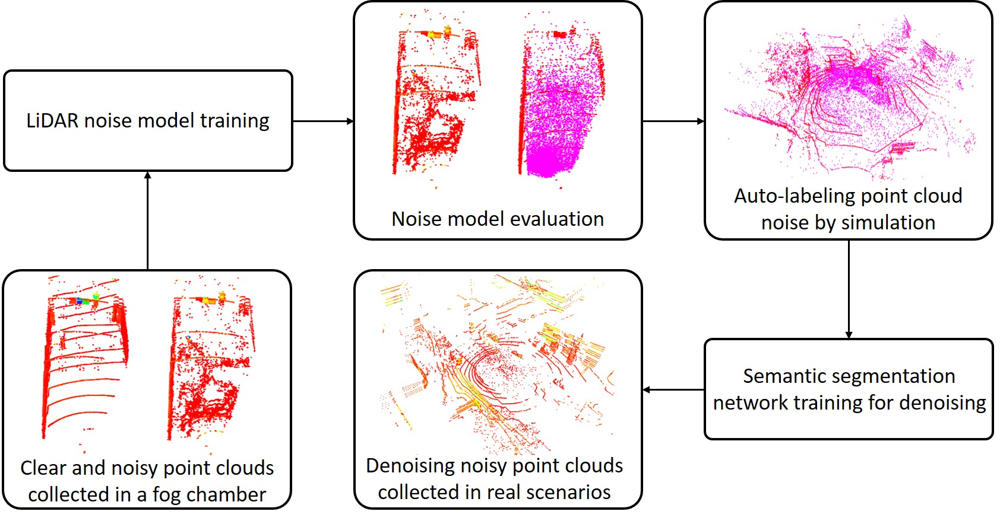

# lanoise++ (IEEE Sensors Journal 2023)

[lanoise_pp](lanoise_pp) is a ROS node to generate noising point clouds with the input of LiDAR's data recorded under clear weather conditions. To use lanoise_pp, we assume that the intensity value of a laser's point should be similar to Velodyne VLP-32C.

[RandLA-Net](RandLA-Net) is to train a point cloud denoising model with the simulation data.

[noise_seg](noise_seg) is a ROS node to filter noising point clouds recorded under adverse weather conditions. The denoising model is trained using simulation data and can be generalized to the real world.

We provide point cloud data and annotations for testing.

The rosbag recorded in clear day:

https://drive.google.com/file/d/1fX_1cdE9wlxZvzyRvz-DsBsXwi_ipDzQ/view?usp=sharing

The rosbag recorded in snowy day:

https://drive.google.com/file/d/1u3KR4VAoFnu__b_tk0z3b2Is5JwCBZsY/view?usp=sharing

Annotations of vehicles in snow:

https://drive.google.com/file/d/1620JHAyV59IC3QFMEzgCvnJ-qMBEoS7Y/view?usp=sharing

## Citation
If you publish work based on, or using, this code, we would appreciate citations to the following:

    @ARTICLE{yt23ieeesj,
        author={Yang, Tao and Yu, Qiyan and Li, You and Yan, Zhi},
        journal={IEEE Sensors Journal}, 
        title={Learn to Model and Filter Point Cloud Noise for a Near-Infrared ToF LiDAR in Adverse Weather}, 
        year={2023},
        volume={23},
        number={17},
        pages={20412-20422},
        doi={10.1109/JSEN.2023.3298909}}
